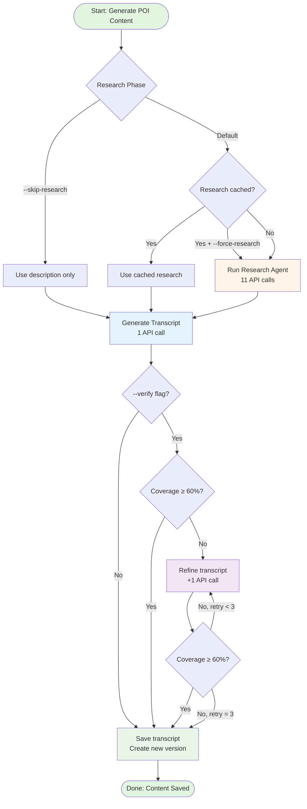
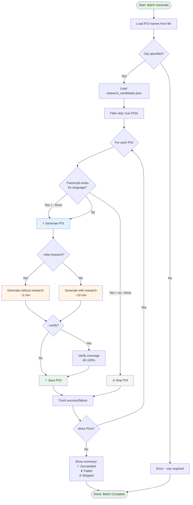
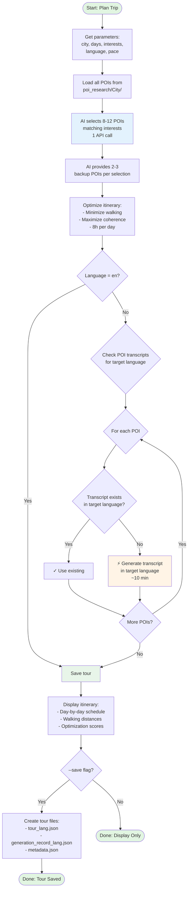
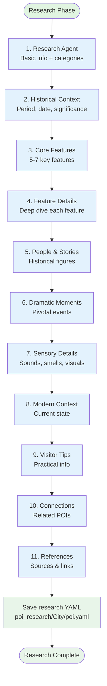
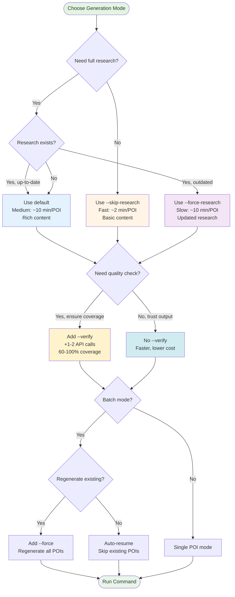

# Pocket Guide CLI Cheatsheet

Quick reference for the Pocket Guide CLI - optimized for readability and quick lookup.

---

## 🚀 Quick Start

### Complete Workflow (30 minutes)

```bash
# 1. Research POIs (AI discovers attractions)
./pocket-guide poi research Rome --count 30

# 2. Extract POI names to file
python3 extract_pois.py Rome > rome_pois.txt

# 3. Generate content (5-10 min per POI)
./pocket-guide poi batch-generate rome_pois.txt --city Rome

# 4. Plan a trip
./pocket-guide trip plan --city Rome --days 3 --interests history --save
```

**That's it!** You now have a complete tour guide with optimized itinerary.

---

## 📚 Table of Contents

- [Server Management](#-server-management)
- [POI Operations](#-poi-operations)
- [Trip Planning](#-trip-planning)
- [Common Workflows](#-common-workflows)
- [Troubleshooting](#-troubleshooting)
- [Appendix: Workflow Diagrams](#-appendix-workflow-diagrams)

---

## 🖥️ Server Management

### Start/Stop Development Servers

```bash
# Start both backend + frontend
./start-dev.sh

# Stop both servers
./stop-dev.sh
```

**Access:**
- Backend API: http://localhost:8000/docs
- Frontend: http://localhost:5173

---

## 🔍 POI Operations

### Research POIs

Discover top attractions using AI.

```bash
./pocket-guide poi research <city> --count <number>

# Examples
./pocket-guide poi research Paris --count 20
./pocket-guide poi research Tokyo --count 50 --provider anthropic
```

**Output:** `poi_research/<City>/research_candidates.json`

**Next steps:**
1. Extract names: `python3 extract_pois.py <city> > pois.txt`
2. Generate content: `./pocket-guide poi batch-generate pois.txt --city <city>`

---

### Generate POI Content

#### Single POI
```bash
./pocket-guide generate \
  --poi-name "Eiffel Tower" \
  --city "Paris" \
  --language en

# Skip research (faster, basic content)
./pocket-guide generate \
  --poi-name "Eiffel Tower" \
  --city "Paris" \
  --skip-research

# Force re-research (update existing research data)
./pocket-guide generate \
  --poi-name "Eiffel Tower" \
  --city "Paris" \
  --force-research

# Enable verification (checks 60-100% coverage, costs more)
./pocket-guide generate \
  --poi-name "Eiffel Tower" \
  --city "Paris" \
  --verify
```

**Options:**
- `--skip-research`: Skip research phase (fast, basic content)
- `--force-research`: Re-do research even if cached
- `--verify`: Enable transcript verification (60-100% coverage check, increases cost)

#### Batch Generation (Recommended)
```bash
./pocket-guide poi batch-generate <file> --city <city>

# Examples
./pocket-guide poi batch-generate pois.txt --city Rome
./pocket-guide poi batch-generate pois.txt --city Rome --skip-research  # Faster
./pocket-guide poi batch-generate pois.txt --city Rome --force  # Regenerate all
./pocket-guide poi batch-generate pois.txt --city Rome --verify  # Enable verification
```

**Options:**
- `--skip-research`: Skip research phase (faster, less rich)
- `--force`: Force regeneration even if content exists
- `--verify`: Enable transcript verification (60-100% coverage, costs more)

**Features:**
- ✅ Auto-resumes from failures
- ✅ Smart verification (optional with `--verify`)
- ✅ API retry logic (5 attempts)
- ⏱️ ~5-10 minutes per POI
- 📊 Coverage check: 60-100% of research (with `--verify`)

**Output:**
- `content/<city>/<poi-id>/transcript_{language}.txt`
- `content/<city>/<poi-id>/summary.txt`
- `content/<city>/<poi-id>/metadata.json`

---

### Check for Duplicates

```bash
./pocket-guide poi check-redundancy <city>

# Example
./pocket-guide poi check-redundancy Athens
```

Marks duplicates with `skip: true` in research_candidates.json.

---

## 🗺️ Trip Planning

### Plan Itinerary

```bash
./pocket-guide trip plan \
  --city <city> \
  --days <number> \
  --interests <interest> \
  --language <lang> \
  --save

# Examples
./pocket-guide trip plan --city Rome --days 3 --interests history --save
./pocket-guide trip plan --city Athens --days 2 --interests mythology --language zh-tw --save
```

**Options:**
- `--city`: City name (required)
- `--days`: Trip duration (required)
- `--interests`: Multiple allowed (`--interests history --interests art`)
- `--language`: ISO 639-1 code (default: `en`)
- `--pace`: `relaxed`, `normal`, `packed`
- `--walking`: `low`, `moderate`, `high`
- `--must-see`: POIs to include
- `--save`: Save the tour

**What happens:**
1. AI selects 8-12 POIs matching interests
2. Provides 2-3 backup POIs per selection
3. Optimizes daily schedule (minimize walking, maximize coherence)
4. Auto-generates missing transcripts in target language
5. Saves language-specific tour files

**Output:**
```
Day 1 (7.5h, 3.2km walking)
  1. Colosseum (2.5h)
  2. Roman Forum (2.0h) ← 10min walk
  3. Palatine Hill (1.5h) ← 5min walk

✓ Tour saved: tours/rome/rome-tour-20260129-111100-aa7baf/
```

---

### View Saved Tours

```bash
# List all tours
./pocket-guide trip list --city <city>

# Show specific tour
./pocket-guide trip show <tour-id> --city <city> --language <lang>

# Examples
./pocket-guide trip list --city Rome
./pocket-guide trip show rome-tour-20260129-111100-aa7baf --city Rome --language zh-tw
```

---

## 🔑 Common Workflows

### Workflow 1: New City Setup

```bash
# 1. Research POIs
./pocket-guide poi research "New York" --count 30

# 2. Extract names
python3 extract_pois.py "New York" > nyc_pois.txt

# 3. Generate content
./pocket-guide poi batch-generate nyc_pois.txt --city "New York"

# 4. Collect metadata (optional - requires Google Maps API)
curl -X POST http://localhost:8000/cities/new-york/collect
```

---

### Workflow 2: Plan Multilanguage Trip

```bash
# 1. Research POIs (English - always)
./pocket-guide poi research Rome --count 50

# 2. Plan trip in Chinese
./pocket-guide trip plan \
  --city Rome \
  --days 2 \
  --interests history \
  --language zh-tw \
  --save

# Auto-generates Chinese transcripts if missing!
```

---

### Workflow 3: Add Single POI

```bash
./pocket-guide generate \
  --poi-name "Notre-Dame Cathedral" \
  --city "Paris" \
  --language fr
```

---

### Workflow 4: Resume Failed Batch

```bash
# If batch fails, just run again - it auto-resumes!
./pocket-guide poi batch-generate pois.txt --city Rome

# Shows:
# ⊘ Colosseum (already exists)
# ⊘ Roman Forum (already exists)
# ⚡ Pantheon (generating...)  ← Resumes here
```

---

## 🆘 Troubleshooting

### Common Issues

| Issue | Solution |
|-------|----------|
| "Module not found" | `source venv/bin/activate` |
| "Port already in use" | `./stop-dev.sh` |
| "Research data not found" | Check `poi_research/<City>/<poi>.yaml` exists |
| API rate limit | Auto-handled (5 retries + 500ms delays) |
| Batch fails midway | Just run again - auto-resumes |

---

### Check API Logs

```bash
# View backend logs
python src/api_server.py

# Test API keys
python test-api-keys.py
```

---

## 📂 File Structure

```
pocket-guide/
├── content/<city>/<poi-id>/       # Generated content
│   ├── transcript_{lang}.txt      # Tour narration
│   ├── summary.txt                # Key points
│   └── metadata.json              # Version history
│
├── poi_research/<City>/           # Research data
│   ├── research_candidates.json   # AI-discovered POIs
│   └── <poi_name>.yaml            # Detailed research
│
└── tours/<city>/<tour-id>/        # Saved tours
    ├── tour_{lang}.json           # Language-specific tour
    └── generation_record_{lang}.json
```

---

## 🎯 Key Features

### POI Generation
- ✅ **Smart verification loop** - 60-100% coverage
- ✅ **API retry logic** - 5 attempts with backoff
- ✅ **Auto-resume** - Skips completed POIs
- ✅ **Multi-language** - 40+ languages supported

### Trip Planning
- ✅ **AI-powered selection** - Matches interests
- ✅ **Backup POIs** - Alternatives if needed
- ✅ **Route optimization** - Minimize walking
- ✅ **Auto-transcripts** - Generates missing languages
- ✅ **Full transparency** - See why POIs were chosen/rejected

### Quality
- ⚡ **Fast**: 5-10 min per POI with research
- 🎭 **Dramatic**: Storytelling-focused narration
- 📊 **Complete**: Research + transcript + metadata
- 🔄 **Versioned**: Full history tracking

---

## 🔗 Quick Links

**Documentation:**
- [API Docs](http://localhost:8000/docs) (when server running)
- [QUICKSTART.md](QUICKSTART.md) - Detailed getting started
- [TRIP_PLANNER_USAGE.md](TRIP_PLANNER_USAGE.md) - Trip planner deep dive

**Troubleshooting:**
- [TROUBLESHOOTING.md](TROUBLESHOOTING.md)
- [DEBUG_INSTRUCTIONS.md](DEBUG_INSTRUCTIONS.md)

---

## 📖 Command Reference

### POI Commands

```bash
# Research
poi research <city> [--count N] [--provider NAME]

# Generate single
generate --poi-name "NAME" --city "CITY" [--language LANG] [--skip-research] [--force-research] [--verify]

# Generate batch
poi batch-generate <file> --city <city> [--skip-research] [--force] [--verify]

# Check duplicates
poi check-redundancy <city>
```

### Trip Commands

```bash
# Plan trip
trip plan --city <city> --days <N> [--interests X] [--language LANG] [--save]

# List tours
trip list --city <city>

# Show tour
trip show <tour-id> --city <city> [--language LANG]

# Generate TTS audio for tour
trip tts <tour-id> --city <city> [--language LANG] [--provider edge|openai|google] [--force]
```

### Utility Scripts

```bash
# Extract POI names
python3 extract_pois.py <city> [--include-skipped] > output.txt

# Generate missing research
python3 generate_missing_research.py
```

---

## 🌐 Language Support

**Supported codes**: `en`, `zh-tw`, `zh-cn`, `es`, `es-mx`, `pt-br`, `fr`, `de`, `it`, `ja`, `ko`, `ar`, etc.

**How it works:**
- Research data: Always English
- Transcripts: Language-specific (`transcript_zh-tw.txt`)
- Tours: Language-specific (`tour_zh-tw.json`)
- Auto-generation: Missing transcripts created on-demand

---

## 🎓 Tips

### Speed vs Quality
- **With research** (default): Rich content, ~10 min/POI
- **Without research** (`--skip-research`): Fast, ~2 min/POI, basic content
- **Re-research** (`--force-research`): Update existing research data
- **With verification** (`--verify`): Ensures 60-100% coverage, costs more (extra API calls)

### Provider Comparison
- **Anthropic (Claude)**: Best storytelling, most dramatic
- **OpenAI (GPT-4)**: Balanced, reliable
- **Google (Gemini)**: Fast, cost-effective

### File Naming
- Content: `kebab-case` (`blue-mosque/`)
- Research: `snake_case` (`blue_mosque.yaml`)
- Cities: `TitleCase` in research, `kebab-case` in content

---

## 📊 Appendix: Workflow Diagrams

### Complete POI Generation Workflow



### Batch Generation Workflow



### Trip Planning Workflow



### Research Phase Detail



### Flag Decision Tree



---

**Last Updated**: February 2026
**Version**: 2.0.0

For detailed information, see [QUICKSTART.md](QUICKSTART.md) or [API Documentation](http://localhost:8000/docs).
